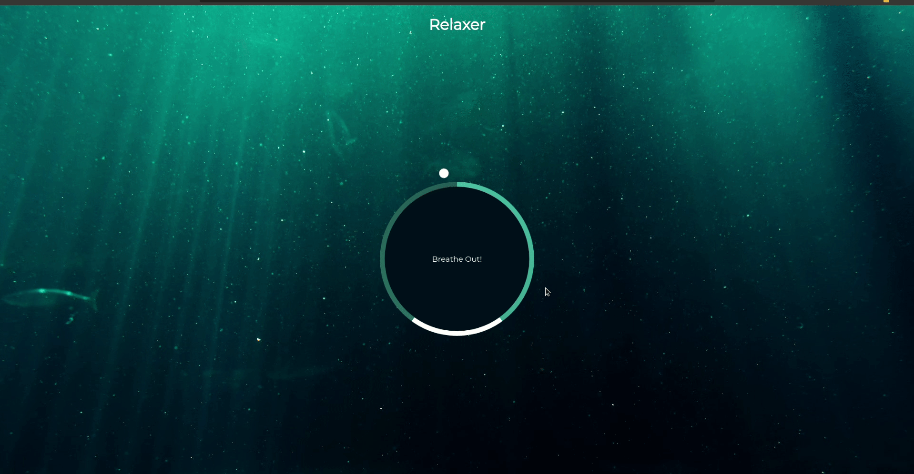

<h1 align="center">
 
Relaxer App
</h1>

🧘 A relaxing breathing app with a visual director to tell you when to breathe in, hold and breathe out

  

[//]: # (Add your gifs/images here:)

  
  

## Tools
[//]: # (Add the features of your project here:)
This app use all the latest tools and practices in web development!

- 🌳 **HTML** — Standard markup language for Web pages.
- 🎨 **CSS** —  A stylesheet language used to describe the presentation of a document written in HTML
- 👨‍💻 **JavaScript** — A lightweight, interpreted, or just-in-time compiled programming language with first-class functions 

## Project Specifications

- Create circle and gradient circle with CSS
- Create and animate pointer (Small circle)
- Create grow and shrink animations
- Add JavaScript to create the breath animation effect

## Getting started

1. Clone the project with `git@github.com:devcass/Relaxer-App.git`
2. Enter in the project with `cd Relaxer-App`
3. Click on the file to open on your favorite browser

## License

This project is licensed under the MIT License - see the [LICENSE](https://opensource.org/licenses/MIT) page for details.

